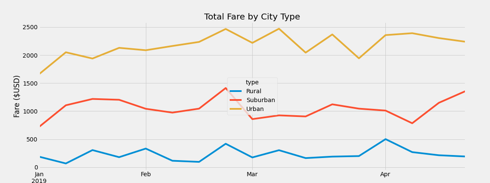

# PyBer Analysis

## Overview
In this challenge we were hired to create a summary of PyBer's ride-sharing data and present it to our employer. We were requested to make a multiple line graph to disply how the total fare changes through the course of a year for each the three city types.

## Results

After the analysis of the PyBer ride data, this multiple line graph was created to visulaize the difference in total fare each month per city type. We created a couple other graphs as well. However they all tell pretty much the same story; Most of the companies revenue is generated within urban cities as by definition they have very high population density. 

This can be demonstrated in the above DataFrame that shows Urban cities have the highest rider and driver count.

## Summary
If I were to make any recommendations to the CEO about this data analysis I would say that the most useful way of analyzing this data would be to figure out the percentage of the population that uses the service. It was expected that the urban cities would have the highest riders and drivers. By defiition there are more people in urban cities than rural ones. If anything all this analysis did was reiterate that point. So, I would suggest dividing the total riders and drivers in each city type by the city's total population. Then you would be able to see which typw of city uses PyBer the least and figure out how to change that.
